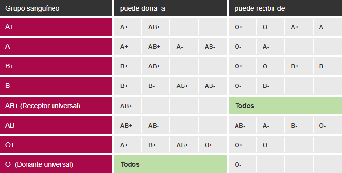

# Tarea 1

Para este primer ejercicio comenzaremos creando nuestra primera clase: Clase de **persona**.
Una vez creada la clase **Persona**, comenzaremos a definir sus atributos: **nombreCompleto** (de tipo String), y **edad** (de tipo int _completo_), **TipoSangre** (de tipo String).
Un registro no tiene funcionalidad en sí mismo, mientras que una clase sí. Una clase representa un elemento de la realidad, los atributos que tiene este elemento y también el comportamiento que tiene el elemento, por ejemplo, una persona puede conducir o no, una persona puede donar sangre a otra persona o no, estos comportamientos no son solo atributos. Tranquilamente más tarde se entenderá mejor con el ejemplo. En este ejercicio se requiere implementar los métodos más sencillos:
- Método constructivo de la clase **persona**: es indispensable que este método especial tenga el mismo nombre que la clase del objeto que construye; este método alquilará la memoria para un objeto de esa clase, iniciando al mismo tiempo los atributos de ese objeto. En general, al método constructivo se le pasan los valores de inicio de atributos como parámetros, pero se implementará de momento asignando a los atributos directamente determinados valores. De esta forma, cada vez que creamos una **persona** nueva tendrá por defecto estos valores (en este caso los valores son de "desconocido" y 0 respectivamente).
- Métodos de obtención (get) y modificación (set) de los valores de los atributos definidos. En este ejercicio **getNombreCompleto**, **setNombreCompleto**, **getEdad**, **setEdad**, (**getTipoSangre** y **setTipoSangreTodavía** no! ¡En la tarea 2!) crearéis métodos.

# Tarea 2: métodos

Ahora se pide incluir más funcionalidades en la clase **Persona**. En particular:
- Nuevo atributo 4: idPersona (total), sexo (caracteres, 'H' o 'M'), nacionalidad (String) y tipo de sangre (String).
- Crea un nuevo constructor. Tendrá como parámetro de entrada los valores que recibirán los seis atributos.
- Implementar el método *tieneMismoId*() devolviendo un booleano. Si el valor de este booleano es true si el idPersona de otra persona que pasamos a este método es igual que el idPersona de nuestra persona (this), de lo contrario devolverá false.
- *puedeConducir*() implementar el método devolviendo un booleano. Este método devolverá *true* cuando tenga el suficiente para guiar a las personas, de lo contrario *false*. Siempre suponiendo que las edades de conducción en diferentes países son diferentes, por ejemplo en Etiopía será con 14 años, en Australia y Estados Unidos con 16 años, en el Reino Unido con 17 años, y en el resto del mundo con 18 años.
- Implementar el método *puedeDonarA*(), devolviéndole un booleano. Este método, tomando una persona como parámetro y siendo nuestra persona (this), decidirá si nuestra persona puede donar sangre a esa otra persona según la tabla que aparece más abajo. Si es posible devolverá true, si no false.
- Implementar el método *getInicialNombre*() para devolver la inicial del nombre de nuestra persona. Haz lo mismo con el apellido *getInicialApellido*().
En el atributo NombreCompleto no estarán los apellidos asociados, pero sí los puede tener:

|Nombre Completo|Inicial nombre|Inicial Apellido|
|:----|:----|:----|
|Juan Martín|J|M|
|Juan Pedro Martín|J|M|
|Juan Pedro Martín García|J|G|

